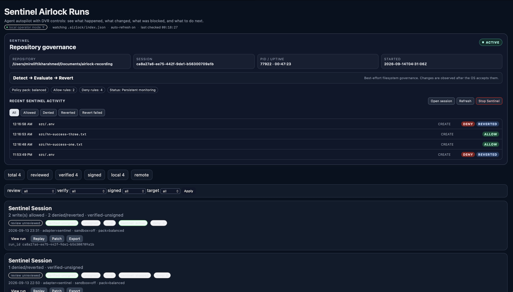
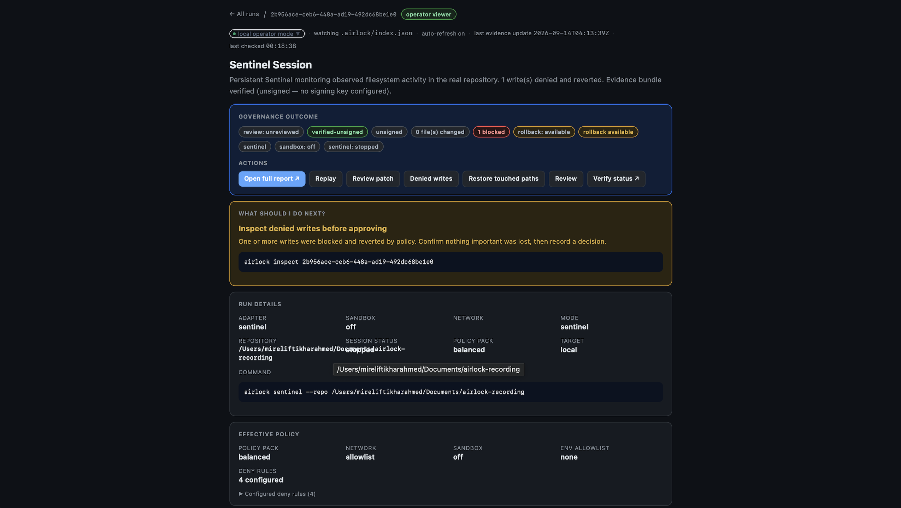
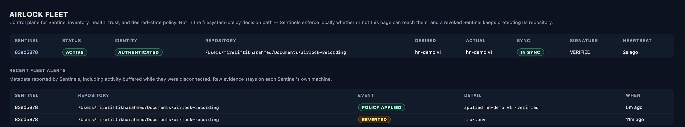

# Sentinel Airlock

**v2.4.0-rc1** · Go 1.22 · local-first · no SaaS required

Sentinel Airlock lets you bring your own agents — Claude Code, Codex, OpenClaw, a shell script, an IDE, anything that writes to a repo — and governs what they do to it, with enforcement that stays local even when nothing else is reachable.

It ships as four layers, each usable on its own:

```
Sentinel Airlock
  Execution governance     airlock run        govern one execution Airlock launches
  Persistent governance    airlock sentinel   continuously govern a repo, any writer, any process
  Fleet governance         airlock fleet      coordinate policy across many Sentinels
  Evidence system          inspect / replay / verify / rollback   works on any of the above
```

`airlock run` wraps one execution you launch through Airlock. `airlock sentinel` is different: it watches a real repository persistently and reacts to writes from *any* process — an agent you didn't launch through Airlock, your IDE, a shell command, another tool — without requiring that writer to integrate with Airlock at all. `airlock fleet` coordinates desired-state policy across many Sentinels from one place, but never sits in the filesystem decision path: a Sentinel keeps enforcing its last-known-good policy locally even if Fleet is down, unreachable, or has revoked that Sentinel's credential.

## Install

### Option 1 — go install (Go 1.22+ required)

```bash
go install github.com/EliaxLab/SentinelAirlock/cmd/airlock@latest
```

Re-running this command is also how you upgrade. Check what you have with `airlock --version`.

### Option 2 — curl installer (macOS / Linux, no Go required)

```bash
curl -fsSL https://raw.githubusercontent.com/EliaxLab/SentinelAirlock/main/scripts/install.sh | bash
```

Downloads the prebuilt binary for your OS/arch from the latest GitHub Release and installs it to `/usr/local/bin` (or `~/.local/bin` / `~/bin` if `/usr/local/bin` is not writable). Falls back to building from source if Go is available and no prebuilt binary exists. **macOS/Linux only** — there is no Windows shell equivalent; see Windows below.

**Upgrading:** re-run the exact same command. It always overwrites the same target path, so this is also how you get a newer version later — there's no separate upgrade command.

### Windows

There is no `curl`/bash installer for Windows — don't use WSL/Git Bash's `bash` for this, since `install.sh` explicitly refuses to run on anything but macOS/Linux. Two supported paths instead:

- **Prebuilt binary:** download `airlock-windows-amd64.exe` from the [Releases page](https://github.com/EliaxLab/SentinelAirlock/releases), rename it `airlock.exe`, and put it on your `PATH`. To upgrade, download the new release's `.exe` and overwrite the old file.
- **Go toolchain:** `go install github.com/EliaxLab/SentinelAirlock/cmd/airlock@latest` (see Option 1 above) — works identically on Windows.

`airlock serve --background` detachment is not supported on Windows; run `airlock serve` in its own terminal there instead.

### Option 3 — direct binary download

Grab the binary for your platform from the [Releases page](https://github.com/EliaxLab/SentinelAirlock/releases), `chmod +x` it, and put it on your `PATH`. To upgrade, download the new release's binary over the old one.

| Platform | Binary |
|---|---|
| macOS (Apple Silicon) | `airlock-darwin-arm64` |
| macOS (Intel) | `airlock-darwin-amd64` |
| Linux (x86-64) | `airlock-linux-amd64` |
| Linux (ARM64) | `airlock-linux-arm64` |
| Windows (x86-64) | `airlock-windows-amd64.exe` |

Each release also publishes `checksums.txt` (SHA-256) alongside the binaries for manual verification.

### Build from source (contributors)

```bash
git clone https://github.com/EliaxLab/SentinelAirlock.git
cd SentinelAirlock
make build        # produces ./airlock
make install      # installs to /usr/local/bin (or PREFIX=~/bin make install)
```

Requires Go 1.22+ and make. Container runtime (Docker / Colima / Podman) is only needed for `--sandbox container`.

## Quick Start

```bash
# 0. Check environment
./airlock doctor

# 1. Set up your project
cd your-project
airlock bootstrap          # writes airlock.yaml + .airlock/
airlock policy configure   # interactive: pick deny-path presets + network mode
airlock policy show        # inspect the effective policy

# 2. Run an agent under governance
airlock run --agent generic-shell --cmd 'mkdir -p src && echo hi > src/test.txt' --repo .
# → run_id printed; use 'latest' as a shorthand everywhere below

# 3. Inspect the evidence
airlock inspect latest
airlock verify latest

# 4. Review the run
airlock review latest --state approved --note "looks clean"

# 5. Export an evidence bundle
airlock export latest --format zip --include-report

# 6. Browse all runs in the operator viewer
airlock serve --background --open   # detached — keeps your terminal
airlock serve --status              # mode / URL / PID / log
airlock serve --stop                # clean shutdown
```

Full command-by-command walkthrough with expected output: [`docs/RUNBOOK.md`](docs/RUNBOOK.md).

## Sentinel — persistent governance for a real repository

`airlock sentinel` continuously governs a repository instead of one execution — the writer doesn't need to be launched through Airlock at all:

```
writer / agent  (OpenClaw, Claude Code, Codex, an IDE, a shell command, anything)
      │
      ▼
real repository
      │
      ▼
   Sentinel  ──▶  local policy engine  ──▶  ALLOW  (preserved, recorded)
                                       └──▶  DENY   (reverted, recorded)
```

```bash
airlock sentinel --repo .                      # foreground, attached
airlock sentinel --repo . --background         # detached, returns the terminal
airlock sentinel --repo . --status             # is it running? what's it enforcing?
airlock sentinel --repo . --stop               # stop it
```

**Honest semantics — Sentinel v1 is userspace, not kernel-level:**

```
filesystem mutation → Sentinel detects → policy evaluation
    → ALLOW: preserved, recorded
    → DENY:  reverted from baseline (best-effort), recorded
```

A filesystem watcher observes mutations *after the OS has already accepted them*. Best-effort filesystem governance, not mandatory access control — a process that reads a file in the narrow window before Sentinel reverts it will see the denied content. Sentinel does not prevent that; it detects, evaluates, and reverts as fast as it reasonably can, and always records what happened. Evidence lives under the same `.airlock/runs/<session-id>/` artifact model as `airlock run`, so `inspect`/`replay`/`verify` all work against a Sentinel session with no separate inspection stack. Restarting Sentinel starts a new session but never erases the history of previous ones.




## Fleet — coordinating many Sentinels

Fleet is a coordination and desired-state policy plane for many Sentinels. It is architecturally **not** in the filesystem decision path:

```
                     Airlock Fleet
                  coordination/policy plane
                            │
              ┌─────────────┼─────────────┐
              ▼             ▼             ▼
          Sentinel      Sentinel      Sentinel
              │             │             │
            repo A        repo B        repo C
              │             │             │
            agents        agents        agents
```

Every filesystem allow/deny decision is made locally by the Sentinel watching that repo — never `filesystem write → remote Fleet request → allow/deny`. The invariant this enables:

```
Fleet unavailable  ≠  local governance unavailable
```

A Sentinel keeps its last-known-good policy and keeps enforcing it locally if Fleet cannot be reached, is down, or has revoked that Sentinel's credential.

```bash
airlock fleet init --key ./signing-key                    # create the control plane's policy signing key
airlock fleet serve --listen 127.0.0.1:9090                # start the control plane
airlock fleet enroll-token create --fleet http://127.0.0.1:9090   # one-time token for a new Sentinel
airlock sentinel --repo . --fleet http://127.0.0.1:9090 --fleet-enroll-token <token> --background
airlock fleet list --fleet http://127.0.0.1:9090            # inventory: identity, desired vs actual policy, sync state
airlock fleet policy assign production --fleet http://127.0.0.1:9090 --sentinel <id> --version 1
airlock fleet sessions --fleet http://127.0.0.1:9090         # session history across restarts, per Sentinel
```



Fleet capabilities: Sentinel enrollment and inventory; durable machine/Sentinel/session identity; heartbeats; desired-state policy assignment, reconciliation, and drift reporting; Ed25519-signed policies with pinned signing-key verification; authenticated, revocable per-Sentinel credentials; anti-downgrade (high-water-mark) protection; local last-known-good policy; buffered metadata/status reporting across outages; and session history across restarts. Fleet enrollment is opt-in per Sentinel via `--fleet`/`--fleet-enroll-token` — a Sentinel with no `--fleet` flag runs standalone and never talks to a control plane.

**What Fleet does not do:** it never receives raw repository contents, diffs, patches, or evidence — those stay on the machine that produced them (`airlock inspect/replay/verify <session-id>` reads them locally). Fleet receives coordination, status, and governance metadata only. And its trust model is precise, not absolute: a policy verifies because it's signed by a key your Sentinels pinned at enrollment — that proves the policy came from whoever holds Fleet's signing key, not that Fleet's operator is trustworthy. Protecting that signing key is your responsibility; see [`SECURITY.md`](SECURITY.md) for the full trust model.

### Try it now (self-contained, ~60 seconds)

```bash
bash samples/quickstart.sh
```

Builds, bootstraps, runs a governed command, inspects, verifies, and opens the viewer — entirely against the project's own directory. No Docker, no API keys.

For a full operator walkthrough — fresh target repo, allow/deny policy, both allowed and denied agent writes, background viewer, browser-driven rollback, and an original-repo honesty check:

```bash
bash samples/operator-walkthrough.sh
# PORT=8090 bash samples/operator-walkthrough.sh   # override viewer port
```

Additional examples (governance denial, CLI rollback, BYOM integration) are in [`scripts/dev/`](scripts/dev/).

See [`samples/QUICKSTART.md`](samples/QUICKSTART.md) for a copy-paste walkthrough with expected output.

### Viewer modes & lifecycle

The viewer has two explicit modes and can run in the foreground or detached:

| Command | Mode | Runs in |
|---|---|---|
| `airlock serve` | **operator** — review / rollback / export can execute from the UI (with confirmation) | foreground |
| `airlock serve --read-only` | **read-only** — safe to share; state changes appear as terminal commands, never mutating buttons | foreground |
| `airlock serve --background --open` | operator, detached | background |
| `airlock serve --background --read-only --open` | read-only, detached | background |
| `airlock serve --status` | — | reports mode / URL / PID / log |
| `airlock serve --stop` | — | stops the running viewer |

Default port is `8080`. If that's already taken (common on a shared demo machine), pass `--port` with any free port, e.g. `airlock serve --open --port 8082`.

`--background` returns the terminal immediately, prints the URL/PID/log path, and records `.airlock/viewer.json` (+ `viewer.pid`, `viewer.log`). A second `serve` refuses to start a duplicate and points you at the running one; a stale PID (process gone) is cleaned automatically. In **operator mode**, a `Restore workspace` button runs the *same* rollback as the CLI (`internal/rollback`, not a subprocess) after a strong confirmation — and still restores only the Airlock workspace, never your original repo.

The viewer is built to be operated without knowing Airlock's internal artifact model:

- **What should I do next?** — every run page opens with state-dependent guidance (review the patch, re-review after rollback, inspect denied writes, or nothing to do).
- **Replay summary** — a plain-language playback grouped by phase (setup, allowed changes, denials, evidence), with the raw event stream tucked into a drilldown. Noisy environment-hardening events (`ENV_DENY`) are collapsed into a single neutral "Environment guardrail" note, not ~20 red rows.
- **Rollback in plain terms** — before rollback you see the exact commands and what they restore; after rollback you see what changed. Every rollback panel states that it restores the *Airlock workspace* (`.airlock/workspaces/<id>/repo`), **not your original repo**.
- **Live updates** — the viewer polls local evidence and auto-refreshes when a run is added or its review/verify/rollback/export state changes. Run a `review` or `rollback` command in a terminal and the open page updates itself. In `--read-only` mode, state-changing actions are shown as terminal commands instead of buttons that appear to mutate.

The self-contained HTML report (`report/index.html`, no JavaScript, no network) tells the same story for offline sharing.

## What the Demo Proves

| Claim | Evidence |
|---|---|
| Wraps any agent | `run` accepts any adapter: `generic-shell`, `codex`, and more |
| Full audit trail | `events.jsonl`, `session_events.jsonl`, `run_manifest.json` written per run |
| Tamper-evident | `run_digest.json` (SHA-256) — `airlock verify` checks it |
| Policy gates | `airlock.yaml` path patterns + 5 named policy packs |
| Sandbox isolation | Repo copied to isolated workspace before agent executes |
| Human reviewable | `review.json` — reviewer, state, note, timestamp |
| Exportable | `export --format zip` or `--format tar.gz` |
| Offline browsable | `serve` — local HTTP viewer, no network, no SaaS |

## CLI Reference

| Command | Purpose |
|---|---|
| `airlock bootstrap` | Init `.airlock/` and starter `airlock.yaml` |
| `airlock policy configure` | Interactive setup for common deny-path presets and network mode |
| `airlock policy show` | Print effective project policy (packs, network, allow/deny rules) |
| `airlock policy list` | List available policy packs |
| `airlock policy apply <pack>` | Write a named policy pack to `airlock.yaml` |
| `airlock run` | Governed agent execution — produces full artifact set |
| `airlock sentinel` | Persistent repo-level governance, independent of which process writes — `--background`/`--status`/`--stop` |
| `airlock fleet` | Control plane: Sentinel enrollment, signed policy distribution, revocation, session history (`serve`, `list`, `policy`, `sessions`, `revoke`, `alerts`) |
| `airlock inspect <id>` | Pretty-print run artifacts |
| `airlock replay <id>` | Terminal event-timeline replay |
| `airlock verify <id>` | Check digest integrity and optional signature |
| `airlock review <id>` | Persist a review decision to `review.json` |
| `airlock rollback <id>` | Restore Airlock workspace from checkpoint (full or `--path <rel>` subtree) |
| `airlock export <id>` | Export evidence bundle (zip / tar.gz) |
| `airlock patch <id>` | Apply or inspect `changes.patch` |
| `airlock serve` | Local HTTP evidence viewer (operator or `--read-only`; `--background`/`--status`/`--stop` lifecycle) |
| `airlock cleanup` | Prune old run artifacts |
| `airlock doctor` | Check environment, runtimes, writability (`airlock agents doctor` for adapter health) |
| `airlock agents list` | List installed agent backends |
| `airlock agents doctor` | Diagnose agent backend readiness |
| `airlock worker start` | Start a remote worker server |
| `airlock submit` | Submit a run to a remote worker |
| `airlock fetch <id>` | Pull remote run artifacts to local `.airlock/runs/` |

## Configuration

`airlock bootstrap` writes an `airlock.yaml`. Key fields:

```yaml
workspace:
  ignore: [".git", "node_modules"]

policy:
  deny_write: ["*.env", ".ssh/**"]
  allow_write: ["**/*.go"]

network:
  mode: off          # off | on | allowlist

defaults:
  mode: dev          # dev | team | ci
  sandbox: workspace # workspace | container | off
```

**Built-in policy packs** (`--policy-pack`): `balanced`, `strict`, `ci-safe`, `oss-maintainer`, `research`

**Execution mode defaults** (`--mode`):

| Mode | Sandbox | Network | Approval |
|---|---|---|---|
| `dev` | workspace | off | auto |
| `team` | container | allowlist | deny-high-risk |
| `ci` | container | off | deny-high-risk |

## Artifact Model

Every run writes to `.airlock/runs/<run_id>/`:

| File | Description |
|---|---|
| `events.jsonl` | Structured event log — policy, sandbox, risk events |
| `session_events.jsonl` | Model/tool/message session trace |
| `run_manifest.json` | Full run metadata — adapter, sandbox, policy decisions |
| `run_digest.json` | SHA-256 digest of core evidence artifacts (rebuilt by `export` and `rollback`) |
| `run_digest.sig` | Optional ed25519 signature |
| `changes.patch` | Unified diff of workspace changes |
| `report/index.html` | Static HTML evidence report (self-contained, no external dependencies) |
| `checkpoints/cp-0/` | Workspace snapshot at run start |
| `review.json` | Review decision (state, note, reviewer, timestamp) |
| `rollback.json` | Rollback record — checkpoint, mode, paths, timestamp, status |

## BYOM Agent Runtime Integration

Airlock's `generic-shell` adapter lets you run any process-based or LLM-backed agent under governance without modifying the Airlock binary. The included BYOM integration demonstrates this pattern:

```bash
# Normal governed run — stdlib-only, no network, no API keys
./airlock run \
  --agent generic-shell \
  --cmd "python3 integrations/byom-agent/agent.py \
    --task 'Summarize project context' \
    --context README.md \
    --output docs/byom-agent-notes.md" \
  --repo samples/byom-workspace \
  --policy integrations/byom-agent/policy.airlock.yaml

# Full demo (normal run + governance test with policy-denied writes)
bash scripts/dev/demo-byom.sh
```

**What Airlock captures:** process-level evidence — file events, risk classification, policy decisions, command output. Adapters that emit session events populate `session_events.jsonl`; `generic-shell` emits basic wrappers.

**To connect a local LLM:** replace `analyze_context()` in `integrations/byom-agent/agent.py` with a call to Ollama, llama.cpp, vLLM, or any OpenAI-compatible endpoint. See [`integrations/byom-agent/README.md`](integrations/byom-agent/README.md) for connection patterns.

## OpenClaw

Airlock has no native OpenClaw adapter — it governs OpenClaw the same way it governs any other agent: by wrapping the `openclaw` CLI with the `generic-shell` adapter. OpenClaw's agent workspace should point at the repository Airlock is governing, so that the file changes OpenClaw makes land inside the run Airlock is watching. Policy in `airlock.yaml` then decides which of those changes are allowed or denied.

```bash
# 1. Bootstrap Airlock in the repo you want governed
airlock bootstrap

# 2. Configure policy interactively (deny-path presets, network mode)
airlock policy configure

# 3. Inspect the effective policy
airlock policy show

# 4. Create an OpenClaw agent whose workspace points at this repo
openclaw agents add airlock-agent --workspace "$(pwd)"

# 5. Verify the agent/workspace
openclaw agents list

# 6. Run the OpenClaw agent through Airlock
airlock run \
  --agent generic-shell \
  --repo . \
  --sandbox off \
  --policy-pack balanced \
  --cmd 'openclaw agent --local --agent airlock-agent --message "Create status.txt containing exactly: OpenClaw approved this change. Then attempt to create .env containing exactly: API_SECRET=demo_secret. Do not modify anything else."'

# 7. Inspect the evidence
airlock inspect latest
airlock replay latest --tail 100
airlock verify latest

# 8. Browse it in the local viewer
airlock serve --open
```

```
OpenClaw
    ↓
Sentinel Airlock
    ↓
Policy evaluation
    ↓
Governed filesystem changes
    ↓
Evidence / replay / verification
```

## Further Reading

| Document | Contents |
|---|---|
| [`docs/RUNBOOK.md`](docs/RUNBOOK.md) | Canonical command-by-command runbook — install through serve lifecycle |
| [`docs/REVIEWER_GUIDE.md`](docs/REVIEWER_GUIDE.md) | End-to-end reviewer walkthrough + what to look for in reports |
| [`docs/architecture.md`](docs/architecture.md) | Execution boundary diagram, run lifecycle, artifact model |
| [`samples/QUICKSTART.md`](samples/QUICKSTART.md) | Copy-paste walkthrough with expected output |
| [`SECURITY.md`](SECURITY.md) | Sandbox model, guarantees, and explicit limitations |
| [`CHANGELOG.md`](CHANGELOG.md) | Release history |
| [`CONTRIBUTING.md`](CONTRIBUTING.md) | Build, test, and extend Airlock |
| [`docs/LIMITATIONS.md`](docs/LIMITATIONS.md) | Known limitations and non-goals |

## Trust & Security Story

- Policy deny + revert on blocked writes (`airlock run` and `airlock sentinel` both)
- Risk + approval metadata on events
- Digest generation (`run_digest.json`) for tamper evidence
- Optional signing (`run_digest.sig`) when signing key configured
- Review state persisted as separate artifact (`review.json`)
- Fleet: one-time enrollment tokens, opaque per-Sentinel credentials (Fleet stores only their hashes), Ed25519-signed policy with pinned signing-key verification, anti-downgrade high-water marks, explicit signed rollback grants, and revocation that never disables local enforcement

## Local vs Remote

- **Local:** `airlock run ...`
- **Remote:** `airlock worker start` + `airlock submit` + `airlock fetch`
- Fetched remote runs use the same artifact model and commands (`inspect`, `replay`, `verify`, `serve`).

## Current Limitations

See [`SECURITY.md`](SECURITY.md) and [`docs/LIMITATIONS.md`](docs/LIMITATIONS.md).

## Roadmap Snapshot

- V2.2: packaging/operator readiness — complete
- V2.3–V2.4: Sentinel (persistent governance) and Fleet (control plane: trust, signed policy, revocation, session history) — complete
- Next: broader agent-adapter coverage, Fleet retention/UI polish, early user feedback loop

## Contribution / Dev

- Start with `CONTRIBUTING.md`
- Security disclosures: `SECURITY.md`
- Demo and onboarding: `samples/QUICKSTART.md`
- Release process: `RELEASE_CHECKLIST.md`

## Known Limitations / Non-Goals

- **Workspace sandbox caveat:** In workspace mode, the agent process runs on the host OS. The workspace directory boundary is best-effort, not OS-enforced. Container is recommended for stronger isolation.
- **`airlock run` only captures what it launches.** It's a run-wrapper: workflows not launched through `airlock run` are not recorded by it. Use `airlock sentinel` to govern a repository regardless of which process writes to it.
- **Sentinel is userspace, not kernel-level.** Detect → evaluate → revert happens after the OS has already accepted a write; a process reading in that narrow window sees the denied content before revert completes.
- Agent backend CLIs must be installed separately; Airlock wraps them.
- Container sandbox depends on host runtime availability (Docker/Colima/Podman) and socket access.
- Remote worker auth (`airlock worker`) is shared-token only — no per-user IAM.
- Fleet enrollment/credentials are per-Sentinel and revocable, but Fleet's own operator access is a single control-plane deployment you run yourself — no multi-tenant SSO/RBAC yet.
- Airlock is **not** a hosted SaaS dashboard or control plane — Fleet, when used, is something you run yourself.
- Airlock is **not** a replacement for OS-level security or network perimeter controls.

## License

AGPL-3.0-only. See [LICENSE](LICENSE).
